Every colour in the theme comes from Starlight's `--sl-color-*` tokens, and the `palette` option picks the preset that defines them. Only the selected palette is bundled, so switching costs nothing extra on the page.

```js
starlightThemeYeti({ palette: 'blue' })
```

The coloured presets keep the accent mid-strength rather than vivid, and tint the grays slightly towards the same hue. The screenshots below are the [Showcase](/showcase/) page built with each preset.

## Yeti (default)

Monochrome silver: slate grays with the accent drawn from the same scale.

**Light**

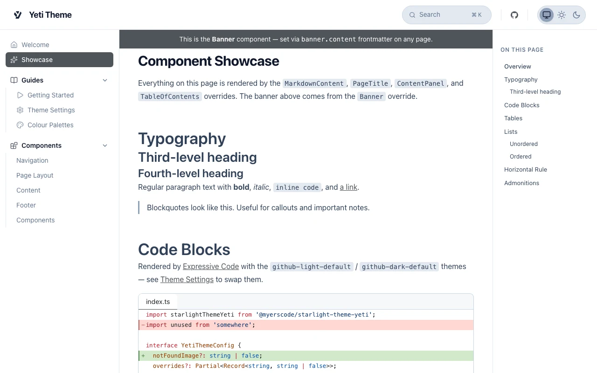

**Dark**

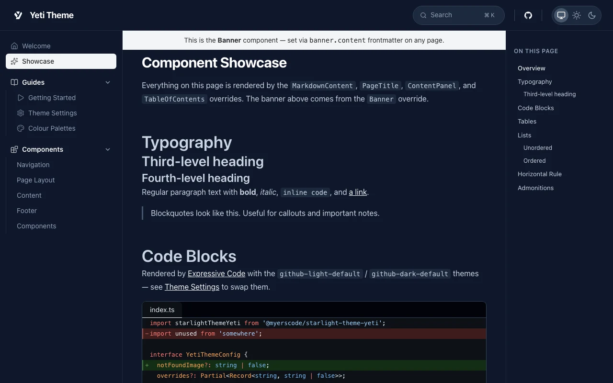

## Black

Black and white with no hue: a near-black page and dark grey surfaces in dark mode; black text, buttons, links, banner and active sidebar item on white in light mode.

**Light**

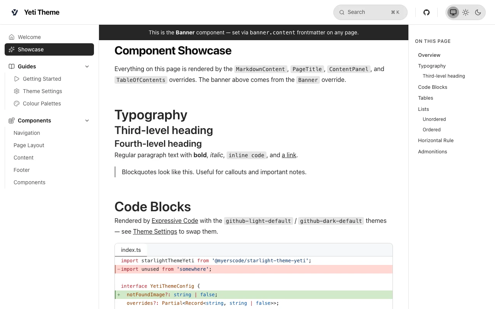

**Dark**

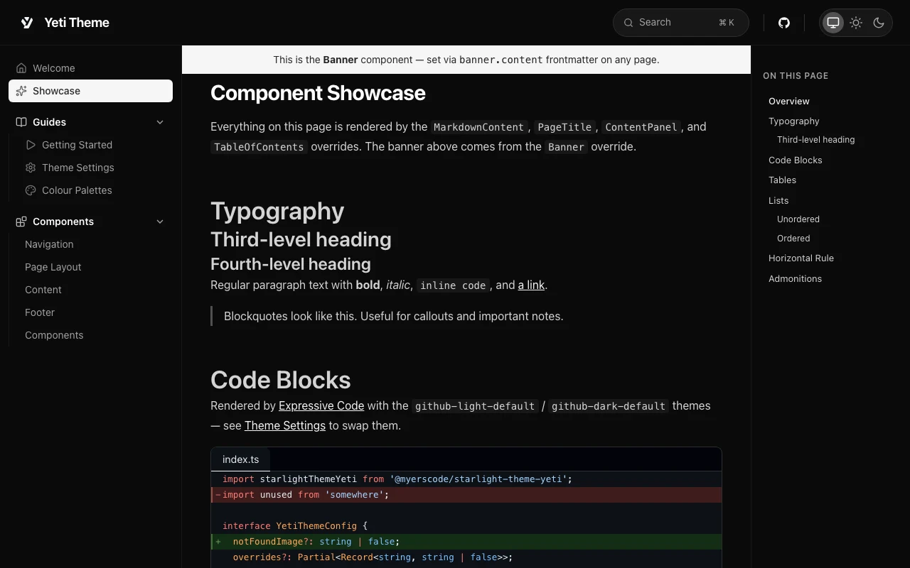

## Blue

**Light**

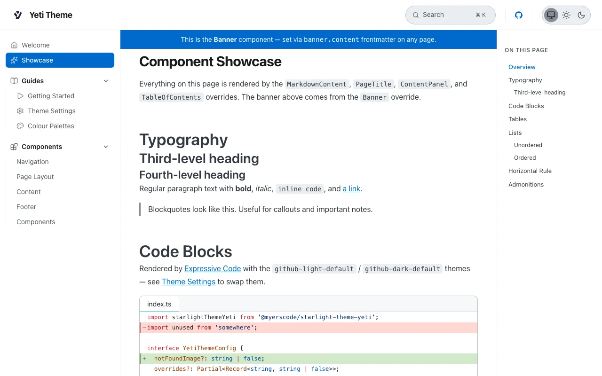

**Dark**

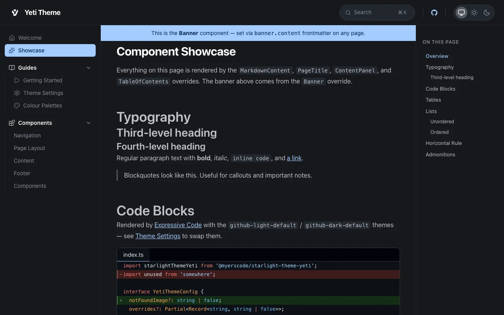

## Green

**Light**

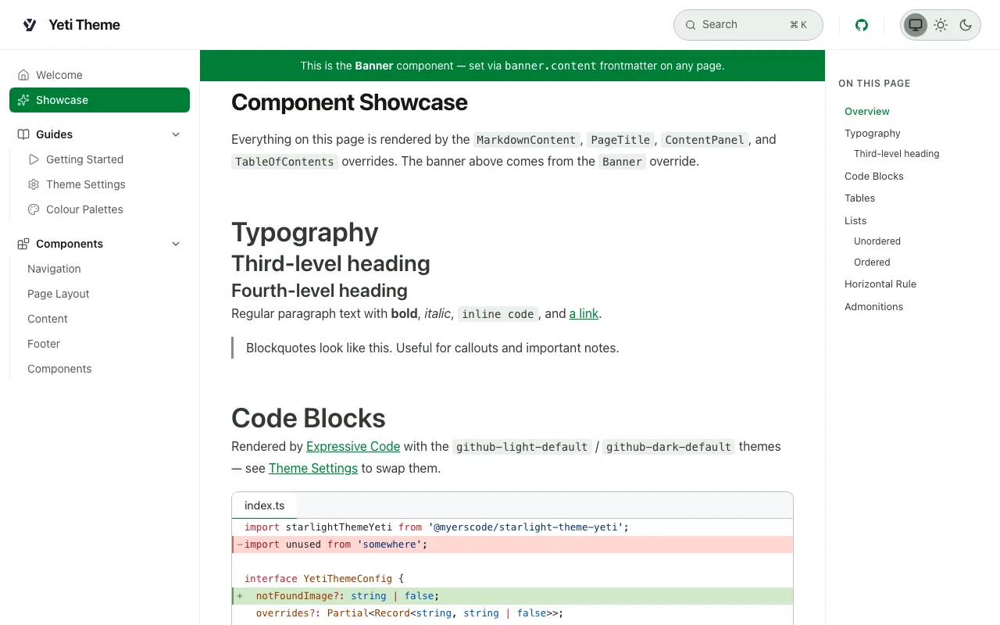

**Dark**

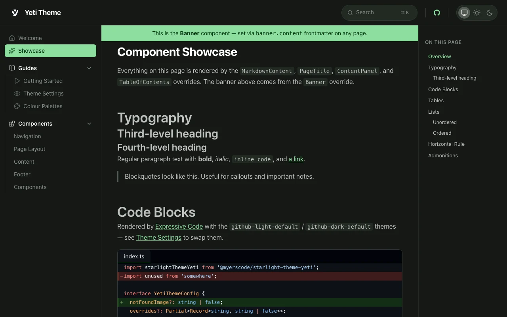

## Orange

**Light**

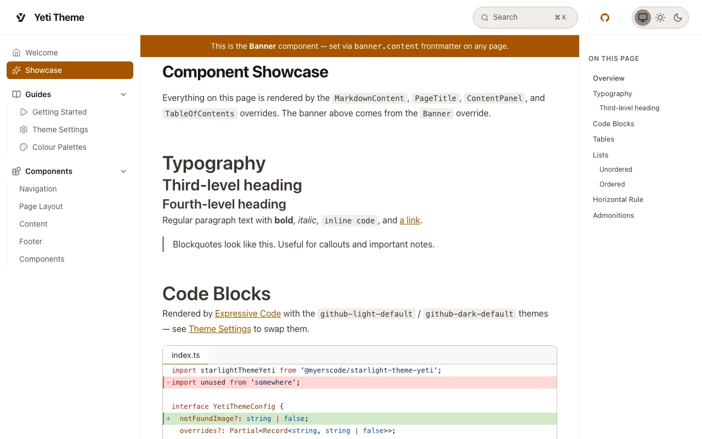

**Dark**

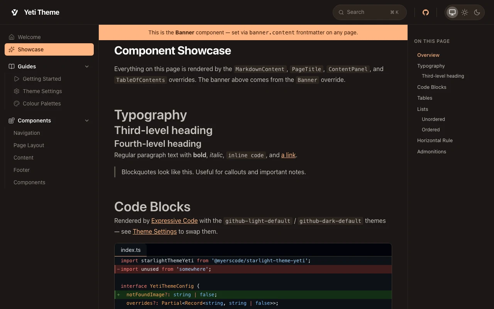

## Purple

**Light**

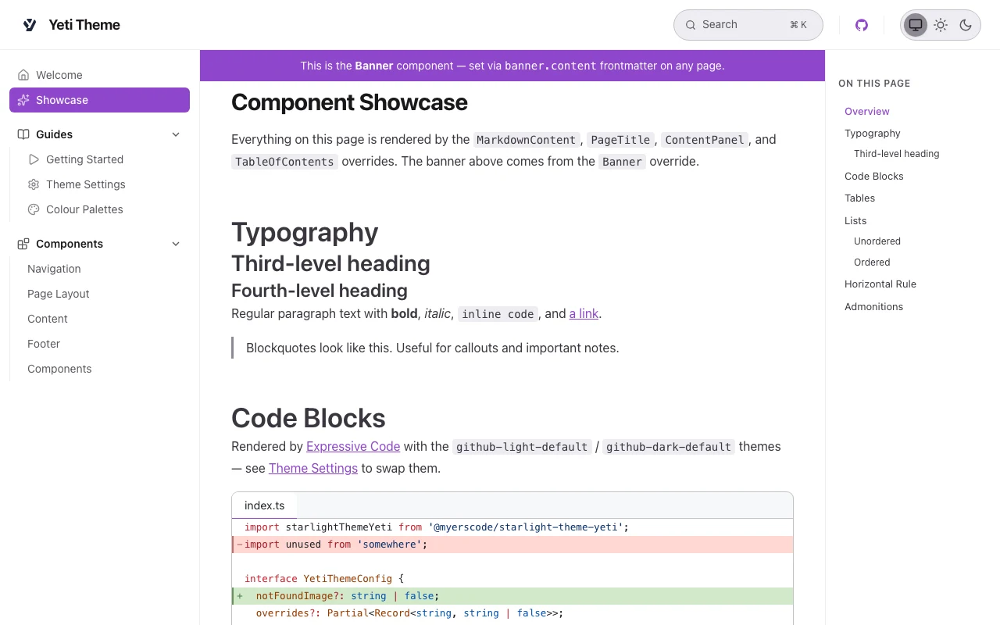

**Dark**

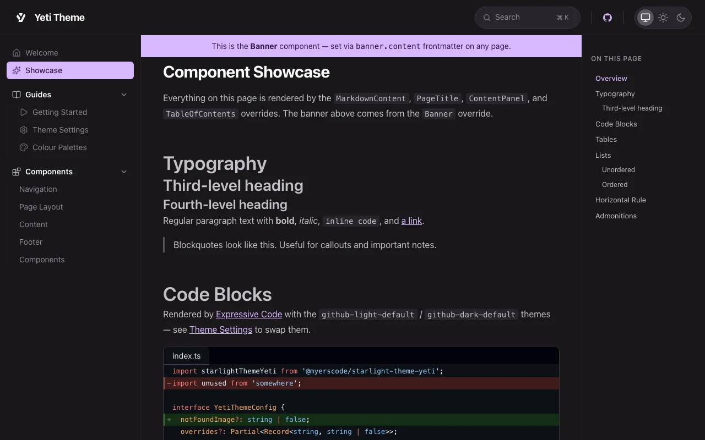

## Red

**Light**

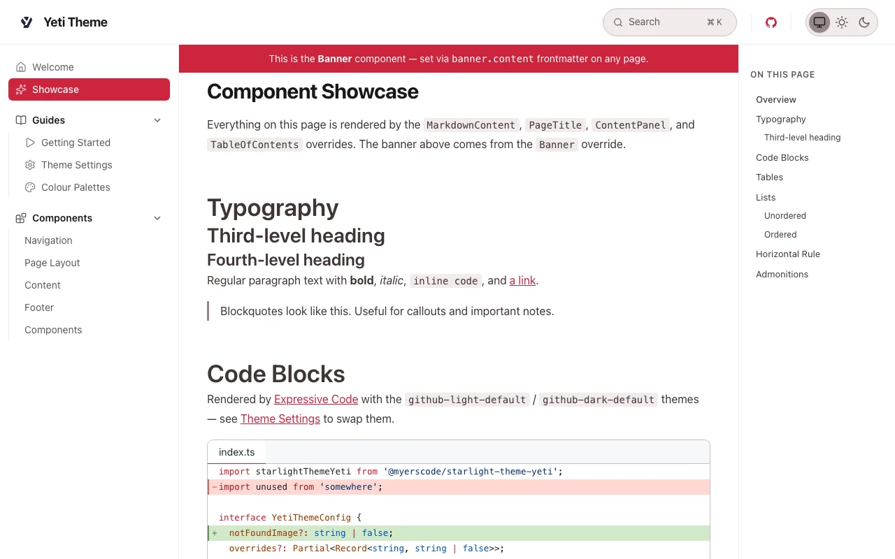

**Dark**

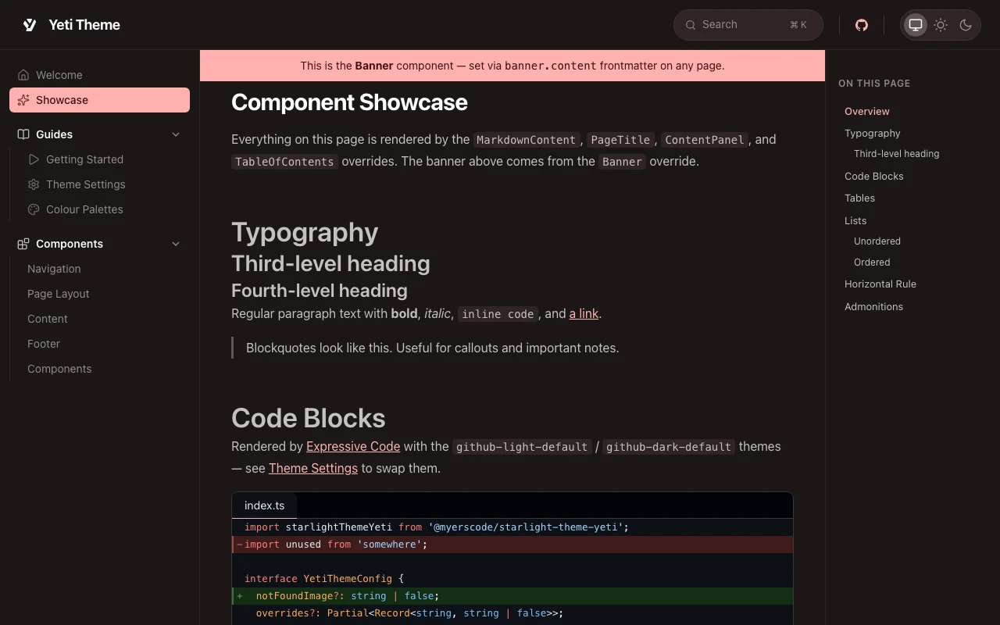

## Yellow

**Light**

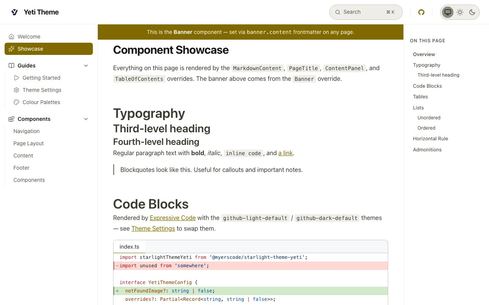

**Dark**

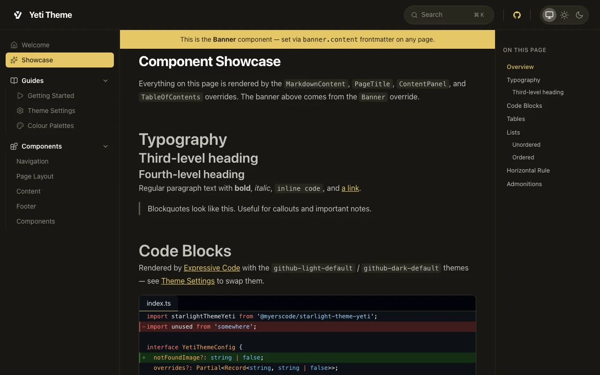
